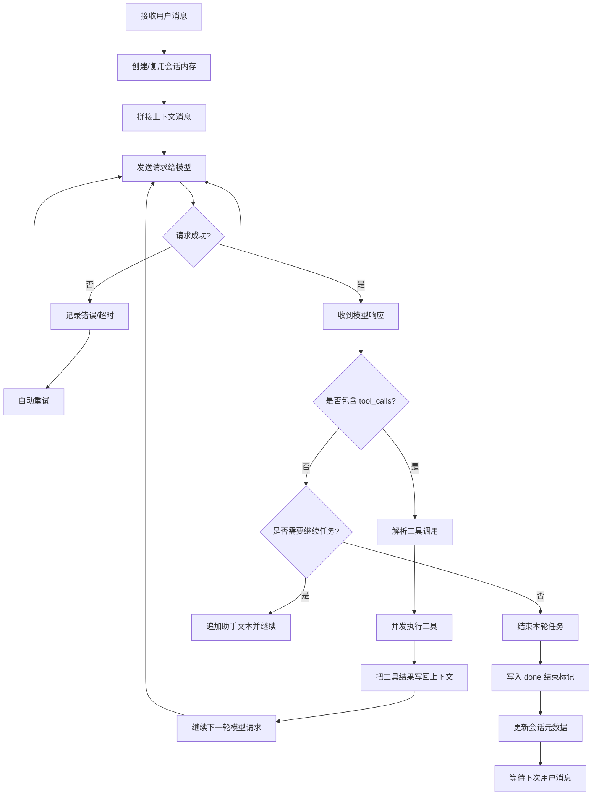

# Chat 状态流流程图

```mermaid
flowchart TD
    A[接收用户消息] --> B[创建/复用会话内存]
    B --> C[拼接上下文消息]
    C --> D[发送请求给模型]

    D --> E{请求成功?}
    E -- 否 --> E1[记录错误/超时]
    E1 --> E2[自动重试]
    E2 --> D

    E -- 是 --> F[收到模型响应]
    F --> G{是否包含 tool_calls?}

    G -- 是 --> H[解析工具调用]
    H --> I[并发执行工具]
    I --> J[把工具结果写回上下文]
    J --> K[继续下一轮模型请求]
    K --> D

    G -- 否 --> L{是否需要继续任务?}
    L -- 是 --> M[追加助手文本并继续]
    M --> D
    L -- 否 --> N[结束本轮任务]

    N --> O[写入 done 结束标记]
    O --> P[更新会话元数据]
    P --> Q[等待下次用户消息]
```

## 说明

- 任务不会再依赖 over_task 作为显式结束信号。
- 只要模型没有调用工具，且当前回复已经足够完成，就自然结束任务。
- 如果 API 请求出现超时、连接失败或异常，会持续重试，直到用户手动停止任务。
