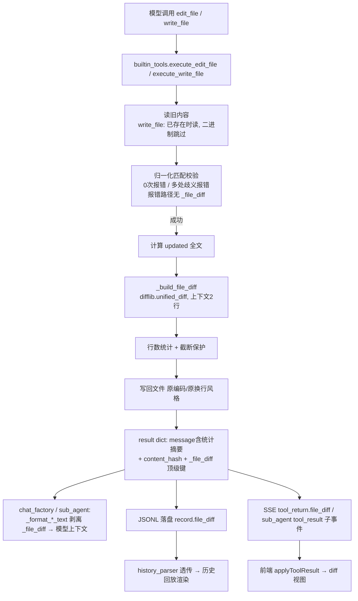

# 文件变更 Diff 设计文档（内置 write_file / edit_file）

> 版本：V1（2026-09 实现并验证）
> 定位：作为文件 diff 功能实现与后续修改的**唯一依据文档**；实现偏差必须回写本文档。
> 参考方案：ChatGPT「设计文件Diff方案」会话（https://chatgpt.com/share/6aa66b49-812c-83e8-ac4d-da81b181ca92），按本项目链路做了取舍。

---

## 0. 决策摘要（相对 GPT 初版方案的取舍）

| # | 议题 | GPT 初版建议 | 本项目决策 | 依据 |
|---|---|---|---|---|
| 1 | 模型编辑协议 | 保持 `old_string/new_string`，**不要让模型直接提交 Unified Diff** | ✅ 完全采纳（现状本就如此） | 行号漂移、context 不匹配、CRLF、hunk 错位等坑多；「模型表达改什么 → 工具定位改哪里 → 工具生成 diff」职责划分更稳 |
| 2 | diff 生成时机 | 写入**之前**生成（read → validate → new_content → diff → write） | ✅ 采纳：edit_file 在内存中用归一化文本算 diff 后写回；write_file 先读旧内容 | 为将来「确认后再写」的审批流留好接入点 |
| 3 | 结果结构 | 新建 `EditResult` dataclass | 🔧 变通：不建 dataclass，直接在现有结构化 result dict 上加字段 | 全链路是 dict 直传（有 `_sub_agent` 先例），加字段零序列化成本 |
| 4 | 前端数据形态 | 后端发结构化 diff 行数组 `{type, old_line, new_line, content}` | ❌ 改用 **unified diff 文本 + 前端轻解析** | 本项目一份工具结果文本同时走「模型上下文 / SSE / JSONL」三条链路，结构化数组体积 3~5 倍会明显吃 token 与历史文件体积；unified diff 是标准格式，前端逐行看首字符即可解析 |
| 5 | diff 进模型上下文 | diff 原样进 result 给模型核对 | ❌ **不进模型上下文**：模型只看 message 中「+N -M 行」统计摘要，diff 全文经 `_file_diff` 顶级键剥离、仅推前端与落盘 | 模型刚提交过 old/new，diff 主要是给用户看的；省 token 且历史文件不膨胀 |
| 6 | 原子写入 | tmp + fsync + os.replace | ⏭️ 暂不做（阶段 2） | 现有 `open(..., newline="")` 写回路径稳定，diff 本体优先落地 |
| 7 | 文件版本校验 | read 返回 content_hash + edit 传 expected_hash | 🔧 折中：本次只加 `content_hash` 字段（铺垫），`expected_hash` 校验放阶段 2 | 成本极低；校验涉及报错语义设计，单独迭代 |
| 8 | history 版本快照 / Batch Edit / preview 审阅 | 均建议实现 | ⏭️ 全部放阶段 2 | GPT 自己也建议第一版收敛 |

---

## 1. 目标与范围

### 1.1 V1 已实现
- 内置 `edit_file`：写回前生成 unified diff（归一化旧文本 vs 更新后文本），结果携带 `_file_diff` 顶级键；message 追加「diff +N -M 行」与「内容指纹 xxxx」；
- 内置 `write_file`：写回前读旧内容（跳过二进制），覆盖 / 追加 / 新建三路径生成 diff；新建文件 diff 呈纯 `+` hunk；追加模式 diff 的 new_text = 旧内容 + 新内容；
- `read_file` 返回 `content_hash`（全文指纹，为阶段 2 版本校验铺垫）；
- diff **不进模型上下文**（主循环与子任务循环统一剥离），仅随 SSE 事件与 JSONL 落盘分发；
- 前端工具块输出区渲染彩色 diff 视图（实时 + 历史回放 + 子任务块三挂点）；
- MCP sys_tools_server 版同名工具不受影响（返回纯文本，无 diff，前端自动回退）。

### 1.2 V1 明确不做（阶段 2 预留）
| 项 | 说明 | 阶段 2 方向 |
|---|---|---|
| 原子写入 | tmp + fsync + os.replace | `factory/agent_runtime/builtin_tools.py` 写回处替换实现即可 |
| 版本校验 | edit 增加 `expected_hash` 参数，与当前 `content_hash` 不匹配时报 `FILE_MODIFIED_EXTERNALLY` | 防御「模型读后用户手改」竞态；`content_hash` 已就绪 |
| 用户审批流 | 展示 diff → 用户确认 → 应用 | 复用现有 `ask_user` 卡片交互，无需新状态机 |
| history_files 版本快照 | `001_main.py → 002_main.py` 链式版本 | 基于 `content_hash` 判断无变化跳过 |
| 同文件 Batch Edit | 一次读入、批量替换、单一总 diff、原子写 | 一个失败全部不写 |
| delete_file / move_file | 统一 FileChange 结果结构 | 复用 `_file_diff` 通道 |

---

## 2. 数据流全景

---

## 3. 后端契约

### 3.1 `_build_file_diff(old_text, new_text, path)` → dict

位置：`factory/agent_runtime/builtin_tools.py`（`_display_path` 之后）。

返回字段：

| 字段 | 类型 | 说明 |
|---|---|---|
| `diff` | str | 标准 unified diff 文本；`--- a/路径` `+++ b/路径` 头 + `@@` hunk；比较前统一换行为 `\n`，展示行不含行尾符 |
| `lines_added` | int | `+` 行数（不含文件头） |
| `lines_removed` | int | `-` 行数（不含文件头） |
| `diff_truncated` | bool | diff 文本超过上限被提前截断时为 true |
| `diff_skipped` | str | `""`（正常）/ `"file_too_large"`（超限跳过）/ `"unchanged"`（内容无变化） |

常量（文件顶部 diff 段注释处）：

| 常量 | 值 | 说明 |
|---|---|---|
| `_FILE_DIFF_MAX_TEXT_CHARS` | 256 * 1024 | 新旧文本任一超过 → 整体跳过（`file_too_large`） |
| `_FILE_DIFF_MAX_DIFF_CHARS` | 20000 | diff 文本累计超限 → 提前截断（`diff_truncated=true`） |
| `_FILE_DIFF_CONTEXT_LINES` | 2 | hunk 上下文行数，作为 `difflib.unified_diff(n=...)` 实际生效 |

边界：
- 新建文件（old 为空）→ 全部 `+` 行；追加模式 new_text = 旧内容 + 新内容（diff 反映最终文件变化）；
- 写入后内容与旧内容完全一致 → `unchanged`；
- 二进制文件：read/edit 现有逻辑已拒绝，天然不产出 diff；
- 报错路径（0 匹配 / 歧义 / 文件不存在）返回 `{"error": ...}`，**不含** `_file_diff`。

### 3.2 `_file_diff` 顶级键与「不进模型上下文」机制

**放置**：`execute_write_file` / `execute_edit_file` 的返回 dict 中带 `_file_diff` 顶级键（与 sub_agent 的 `_sub_agent` 键同构）。

**三条消费链路**（同一次结果，三种去向）：

| 去向 | 处理点 | 行为 |
|---|---|---|
| 模型上下文 | `factory/chat_factory.py::_format_tool_result` 与 `factory/agent_runtime/sub_agent.py::_format_result_text` | 统一剥离 `_file_diff` 后 json.dumps；模型只在 message 里看到「diff +N -M 行」统计 |
| JSONL 落盘 | `chat_factory.py` 主循环 history_record（正常结果路径） | record 增加 `file_diff` 字段（与 `result` 并列） |
| SSE 事件 | `chat_factory.py` tool_return 事件与 `sub_agent.py` 正常 tool_result 子事件 | 事件对象增加 `file_diff` 字段（与 `result` 并列） |

> 超大结果（oversized）拒绝路径**不带** diff（feedback 替换文本时 diff 已剥离，历史记录走 oversized 分支本身不带）。

### 3.3 `content_hash`

- 生成：`_content_hash(text)` = 解码后全文 UTF-8 sha256 前 16 位 hex（`errors="replace"`）；
- 三个工具均返回：
  - `read_file`：**全文**（非本次读取区间）的指纹；两个 return 点（lines 模式与 char_chunk 模式）都有；
  - `edit_file`：替换后全文的指纹；
  - `write_file`：写入内容的指纹（空内容省略）；
- message 同步附带「内容指纹 xxxx」便于用户/模型肉眼比对；
- 阶段 2 用法：模型把 read_file 拿到的 hash 作为 `edit_file.expected_hash` 传入，执行时与当前文件 `content_hash` 比对，不一致报 `FILE_MODIFIED_EXTERNALLY`。

---

## 4. 前端契约

### 4.1 识别逻辑（不依赖工具名白名单）

`H5/js/app/messages.js::applyToolResult(block, name, resultText, fileDiff)`（模块级函数，已导出 `App.applyToolResult`）：

- 入参 `fileDiff` 为对象且 `resultText` 能 `JSON.parse` 出含 `path` 字段的对象 → **diff 视图 + 摘要文本**；
- 否则一律回退 `setOutput(原文纯文本)`。

这样设计的原因：
1. 旧 JSONL 历史无 `file_diff` 字段 → 自动回退，无需迁移；
2. MCP sys_tools_server 版同名工具返回纯文本 → 自动回退；
3. 识别条件只看结构特征（file_diff 存在 + parse 成功 + 有 path），将来 MCP 版若对齐结构可直接复用。

### 4.2 摘要文本

diff 视图渲染在输出区上方，输出区文本替换为「后端 message + （补充统计）」：
- 有行数变化 → message 原文（后端已含「diff +N -M 行」）；
- `diff_skipped="unchanged"` → 追加「内容无变化」；`file_too_large` → 追加「文件过大，跳过 diff」；
- 无行数变化且无 skipped 的 write_file → 追加「新建文件」/「全文覆盖」。

### 4.3 diff 视图渲染规则（`buildDiffView`）

解析与后端 `difflib.unified_diff` 输出强约定：

| 行首 | 类名 | 渲染 |
|---|---|---|
| `@@` | `is-hunk` | 淡化分隔行；正则 `@@ -(old)(?:,n)? +(new)(?:,n)?` 提取双侧行号起点 |
| `--- ` / `+++ ` | `is-file` | 文件头淡化 |
| `+` | `is-add` | 绿底；双行号列只显示新行号 |
| `-` | `is-del` | 红底；双行号列只显示旧行号 |
| 其他 | `is-ctx` | 上下文行；双侧行号递增 |

结构：`.diff-view` → `.diff-bar`（「文件变更」标题 + `+N` 绿 / `-N` 红 徽标 + 截断/跳过提示）+ `.diff-code`（逐行 `.diff-line`，含 `.diff-no` 双行号列、`.diff-sign` 符号列、`.diff-text` 内容列）。

### 4.4 挂点与状态机

| 挂点 | 位置 | 接入 |
|---|---|---|
| 实时 tool_result | `H5/js/app/chat.js` 两处（sub_agent 降级块 + 普通工具块） | `App.applyToolResult(ui, name, resultText, tr.file_diff)` |
| 历史回放 | `H5/js/history_parser.js` 透传 `evt.file_diff` → `messages.js::renderRecords` 的 toolResult 分支 | `applyToolResult(ui, rec.name, rec.result, rec.file_diff)` |
| 子任务块 | `messages.js::fillToolEntry`（tool_result 子事件） | `applyToolResult(entry, evt.tool_name, resultText, evt.file_diff)` |

tool-block 状态机配套：
- `setDiff(diff)`：渲染 diff 视图并插入到「输出」标签之前；同时在块标题栏挂载 `.tool-block-diff` 徽标（`+N -M` 着色 / `无变化` / `文件过大`），并给块加 `has-diff` 类——**块默认折叠时标题栏也能一眼看到文件变更**；
- `clearDiff()`：移除 diff 视图 + 徽标（`beginStream()` 时调用，新一轮流式开始防残留）；
- `finish()` **不再清空 diff**（v1 修复：三个消费点均为「applyToolResult → finish」顺序，原先 finish 里 clearDiff 会把刚挂上的 diff 清掉，导致实时与回放都看不到卡片）；
- outPre 加类名 `tool-io-out` 便于样式区分输出区。

---

## 5. 样式

`H5/style/scss/_chat.scss`（tool-block 样式块之后）新增 `.diff-view` 系列：

- 明色：add 行 `rgba(46,160,67,.16)` 绿底、del 行 `rgba(248,81,73,.16)` 红底、徽标 `#1a7f37` / `#cf222e`；
- 暗色（`html[data-theme="dark"]`）：徽标换 `#7ee787` / `#ff9492`；
- `.diff-code` `max-height: 260px` 滚动；`.diff-no` 双行号列 `min-width: 56px` 右对齐；等宽字体与 tool-io 一致。

**改 SCSS 后必须重编译**：`sass H5\style\scss\main.scss H5\style\css\main.css --style=expanded --no-source-map`（sass 在 D:\npm_global）。

---

## 6. 兼容性矩阵

| 场景 | 行为 |
|---|---|
| 旧会话 JSONL（无 file_diff 字段） | history_parser 不透传 → applyToolResult 回退纯文本，回放正常 |
| MCP 版 write_file/edit_file（外部协议） | result 为纯文本字符串 → 回退纯文本 |
| 后端旧版本 + 新前端 | 事件无 file_diff → applyToolResult 直接走纯文本分支，不报错 |
| 新后端 + 旧前端缓存 | 多出的 file_diff 字段被忽略，输出仍为 result 纯文本 |
| 超大文件（>256KB） | diff 置空 + `diff_skipped="file_too_large"`，前端显示「文件过大，跳过 diff」 |
| write_file 覆盖二进制文件 | 读旧内容时检测到二进制 → old_text 为空 → diff 呈纯 `+`（按新建语义展示） |

---

## 7. 测试与验证

`test/test_file_diff.py`（13 用例）：
- `_build_file_diff`：基础替换统计 / 文件头格式 / CRLF 归一化 / 新建全 `+` / 超限跳过 / unchanged；
- `write_file`：新建 / 覆盖 / 追加三路径的 `_file_diff` 与 `content_hash`；
- `edit_file`：成功携带 diff 与 hash（message 含「diff +1 -1 行」）；报错路径无 `_file_diff`；
- `_format_result_text` / `_format_tool_result` 剥离 `_file_diff`（模型上下文无 diff）；
- `read_file` 全文 `content_hash`。

验证命令：`python -m pytest test/test_file_diff.py -q --no-header`；全量 `python -m pytest -q --no-header`（当前 468 passed）。

---

## 8. 相关文件清单

| 文件 | 内容 |
|---|---|
| `factory/agent_runtime/builtin_tools.py` | `_build_file_diff` / `_content_hash` / 两个执行器接入 / `_file_diff` 顶级键 / content_hash |
| `factory/chat_factory.py` | `_format_tool_result` 剥离；主循环 JSONL 落盘 record.file_diff；SSE tool_return.file_diff |
| `factory/agent_runtime/sub_agent.py` | `_format_result_text` 剥离；正常 tool_result 子事件带 file_diff |
| `H5/js/history_parser.js` | toolResult 记录透传 `file_diff` |
| `H5/js/app/messages.js` | `buildDiffView` / `applyToolResult` / buildToolBlock 的 setDiff/clearDiff/finish/beginStream/挂点 |
| `H5/js/app/chat.js` | 两处 tool_return 挂点改走 applyToolResult |
| `H5/style/scss/_chat.scss` | diff 视图样式（明/暗主题） |
| `docs/api_docs.md` | 「文件变更 diff」一节（字段速查） |
