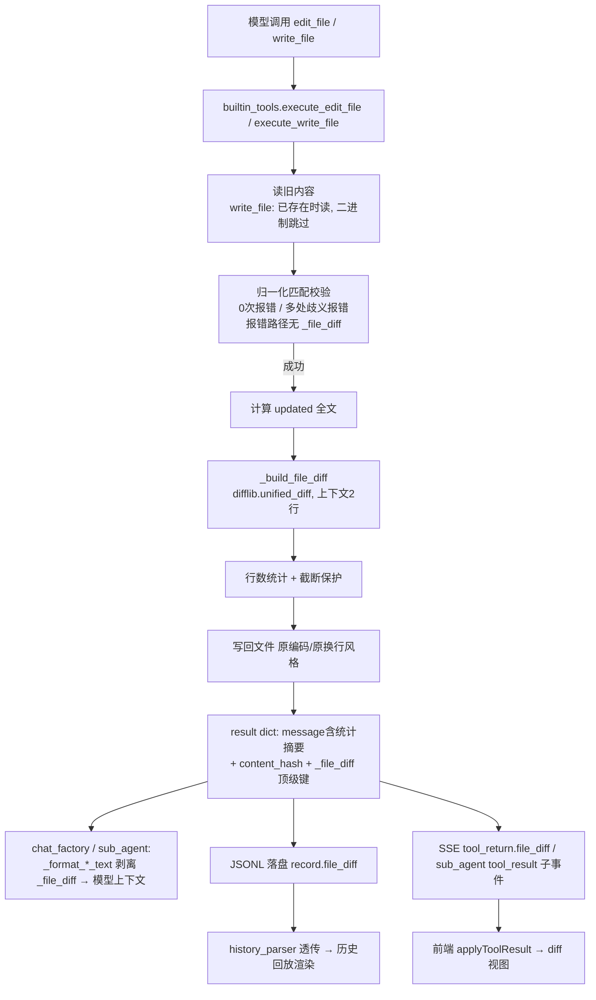
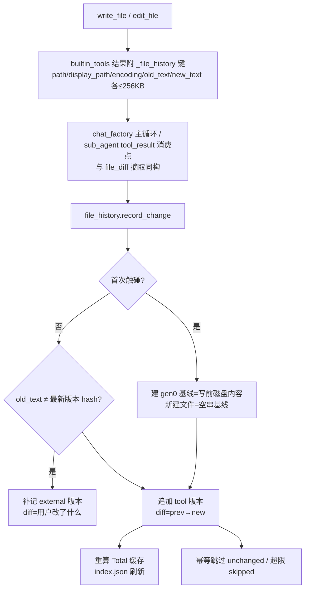

# 文件变更 Diff 设计文档（内置 write_file / edit_file）

> 版本：V2（2026-09 实现并验证；V1 2026-09，V1.1 前端行内高亮追加）
> 定位：作为文件 diff 功能实现与后续修改的**唯一依据文档**；实现偏差必须回写本文档。
> 参考方案：ChatGPT「设计文件Diff方案」会话（https://chatgpt.com/share/6aa66b49-812c-83e8-ac4d-da81b181ca92），按本项目链路做了取舍；
> V2 参考：ChatGPT「VSCode文件Diff原理」（https://chatgpt.com/share/6aa8a579-a970-83e8-9c15-8e0a06127c41）的 Baseline + ChangeSet + Version + Diff + Undo 模型，§9 为落地实现。

---

## 0. 决策摘要（相对 GPT 初版方案的取舍）

| # | 议题 | GPT 初版建议 | 本项目决策 | 依据 |
|---|---|---|---|---|
| 1 | 模型编辑协议 | 保持 `old_string/new_string`，**不要让模型直接提交 Unified Diff** | ✅ 完全采纳（现状本就如此） | 行号漂移、context 不匹配、CRLF、hunk 错位等坑多；「模型表达改什么 → 工具定位改哪里 → 工具生成 diff」职责划分更稳 |
| 2 | diff 生成时机 | 写入**之前**生成（read → validate → new_content → diff → write） | ✅ 采纳：edit_file 在内存中用归一化文本算 diff 后写回；write_file 先读旧内容 | 为将来「确认后再写」的审批流留好接入点 |
| 3 | 结果结构 | 新建 `EditResult` dataclass | 🔧 变通：不建 dataclass，直接在现有结构化 result dict 上加字段 | 全链路是 dict 直传（有 `_sub_agent` 先例），加字段零序列化成本 |
| 4 | 前端数据形态 | 后端发结构化 diff 行数组 `{type, old_line, new_line, content}` | ❌ 改用 **unified diff 文本 + 前端轻解析** | 本项目一份工具结果文本同时走「模型上下文 / SSE / JSONL」三条链路，结构化数组体积 3~5 倍会明显吃 token 与历史文件体积；unified diff 是标准格式，前端逐行看首字符即可解析 |
| 5 | diff 进模型上下文 | diff 原样进 result 给模型核对 | ❌ **不进模型上下文**：模型只看 message 中「+N -M 行」统计摘要，diff 全文经 `_file_diff` 顶级键剥离、仅推前端与落盘 | 模型刚提交过 old/new，diff 主要是给用户看的；省 token 且历史文件不膨胀 |
| 6 | 原子写入 | tmp + fsync + os.replace | ⏭️ 暂不做（阶段 2） | 现有 `open(..., newline="")` 写回路径稳定，diff 本体优先落地 |
| 7 | 文件版本校验 | read 返回 content_hash + edit 传 expected_hash | 🔧 折中：本次只加 `content_hash` 字段（铺垫），`expected_hash` 校验放阶段 2 | 成本极低；校验涉及报错语义设计，单独迭代 |
| 8 | history 版本快照 / Batch Edit / preview 审阅 | 均建议实现 | ⏭️ 全部放阶段 2 | GPT 自己也建议第一版收敛 |

---

## 1. 目标与范围

### 1.1 V1 已实现
- 内置 `edit_file`：写回前生成 unified diff（归一化旧文本 vs 更新后文本），结果携带 `_file_diff` 顶级键；message 追加「diff +N -M 行」与「内容指纹 xxxx」；
- 内置 `write_file`：写回前读旧内容（跳过二进制），覆盖 / 追加 / 新建三路径生成 diff；新建文件 diff 呈纯 `+` hunk；追加模式 diff 的 new_text = 旧内容 + 新内容；
- `read_file` 返回 `content_hash`（全文指纹，为阶段 2 版本校验铺垫）；
- diff **不进模型上下文**（主循环与子任务循环统一剥离），仅随 SSE 事件与 JSONL 落盘分发；
- 前端工具块输出区渲染彩色 diff 视图（实时 + 历史回放 + 子任务块三挂点）；
- MCP sys_tools_server 版同名工具不受影响（返回纯文本，无 diff，前端自动回退）。

### 1.2 V1 明确不做（阶段 2 预留）
| 项 | 说明 | 阶段 2 方向 |
|---|---|---|
| 原子写入 | tmp + fsync + os.replace | `factory/agent_runtime/builtin_tools.py` 写回处替换实现即可 |
| 版本校验 | edit 增加 `expected_hash` 参数，与当前 `content_hash` 不匹配时报 `FILE_MODIFIED_EXTERNALLY` | 防御「模型读后用户手改」竞态；`content_hash` 已就绪 |
| 用户审批流 | 展示 diff → 用户确认 → 应用 | 复用现有 `ask_user` 卡片交互，无需新状态机 |
| history_files 版本快照 | `001_main.py → 002_main.py` 链式版本 | 基于 `content_hash` 判断无变化跳过 |
| 同文件 Batch Edit | 一次读入、批量替换、单一总 diff、原子写 | 一个失败全部不写 |
| delete_file / move_file | 统一 FileChange 结果结构 | 复用 `_file_diff` 通道 |

---

## 2. 数据流全景



---

## 3. 后端契约

### 3.1 `_build_file_diff(old_text, new_text, path)` → dict

位置：`factory/agent_runtime/builtin_tools.py`（`_display_path` 之后）。

返回字段：

| 字段 | 类型 | 说明 |
|---|---|---|
| `diff` | str | 标准 unified diff 文本；`--- a/路径` `+++ b/路径` 头 + `@@` hunk；比较前统一换行为 `\n`，展示行不含行尾符 |
| `lines_added` | int | `+` 行数（不含文件头） |
| `lines_removed` | int | `-` 行数（不含文件头） |
| `diff_truncated` | bool | diff 文本超过上限被提前截断时为 true |
| `diff_skipped` | str | `""`（正常）/ `"file_too_large"`（超限跳过）/ `"unchanged"`（内容无变化） |

常量（文件顶部 diff 段注释处）：

| 常量 | 值 | 说明 |
|---|---|---|
| `_FILE_DIFF_MAX_TEXT_CHARS` | 256 * 1024 | 新旧文本任一超过 → 整体跳过（`file_too_large`） |
| `_FILE_DIFF_MAX_DIFF_CHARS` | 20000 | diff 文本累计超限 → 提前截断（`diff_truncated=true`） |
| `_FILE_DIFF_CONTEXT_LINES` | 2 | hunk 上下文行数，作为 `difflib.unified_diff(n=...)` 实际生效 |

边界：
- 新建文件（old 为空）→ 全部 `+` 行；追加模式 new_text = 旧内容 + 新内容（diff 反映最终文件变化）；
- 写入后内容与旧内容完全一致 → `unchanged`；
- 二进制文件：read/edit 现有逻辑已拒绝，天然不产出 diff；
- 报错路径（0 匹配 / 歧义 / 文件不存在）返回 `{"error": ...}`，**不含** `_file_diff`。

### 3.2 `_file_diff` 顶级键与「不进模型上下文」机制

**放置**：`execute_write_file` / `execute_edit_file` 的返回 dict 中带 `_file_diff` 顶级键（与 sub_agent 的 `_sub_agent` 键同构）。

**三条消费链路**（同一次结果，三种去向）：

| 去向 | 处理点 | 行为 |
|---|---|---|
| 模型上下文 | `factory/chat_factory.py::_format_tool_result` 与 `factory/agent_runtime/sub_agent.py::_format_result_text` | 统一剥离 `_file_diff` 后 json.dumps；模型只在 message 里看到「diff +N -M 行」统计 |
| JSONL 落盘 | `chat_factory.py` 主循环 history_record（正常结果路径） | record 增加 `file_diff` 字段（与 `result` 并列） |
| SSE 事件 | `chat_factory.py` tool_return 事件与 `sub_agent.py` 正常 tool_result 子事件 | 事件对象增加 `file_diff` 字段（与 `result` 并列） |

> 超大结果（oversized）拒绝路径**不带** diff（feedback 替换文本时 diff 已剥离，历史记录走 oversized 分支本身不带）。

### 3.3 `content_hash`

- 生成：`_content_hash(text)` = 解码后全文 UTF-8 sha256 前 16 位 hex（`errors="replace"`）；
- 三个工具均返回：
  - `read_file`：**全文**（非本次读取区间）的指纹；两个 return 点（lines 模式与 char_chunk 模式）都有；
  - `edit_file`：替换后全文的指纹；
  - `write_file`：写入内容的指纹（空内容省略）；
- message 同步附带「内容指纹 xxxx」便于用户/模型肉眼比对；
- 阶段 2 用法：模型把 read_file 拿到的 hash 作为 `edit_file.expected_hash` 传入，执行时与当前文件 `content_hash` 比对，不一致报 `FILE_MODIFIED_EXTERNALLY`。

---

## 4. 前端契约

### 4.1 识别逻辑（不依赖工具名白名单）

`H5/js/app/messages.js::applyToolResult(block, name, resultText, fileDiff)`（模块级函数，已导出 `App.applyToolResult`）：

- 入参 `fileDiff` 为对象且 `resultText` 能 `JSON.parse` 出含 `path` 字段的对象 → **diff 视图 + 摘要文本**；
- 否则一律回退 `setOutput(原文纯文本)`。

这样设计的原因：
1. 旧 JSONL 历史无 `file_diff` 字段 → 自动回退，无需迁移；
2. MCP sys_tools_server 版同名工具返回纯文本 → 自动回退；
3. 识别条件只看结构特征（file_diff 存在 + parse 成功 + 有 path），将来 MCP 版若对齐结构可直接复用。

### 4.2 摘要文本

diff 视图渲染在输出区上方，输出区文本替换为「后端 message + （补充统计）」：
- 有行数变化 → message 原文（后端已含「diff +N -M 行」）；
- `diff_skipped="unchanged"` → 追加「内容无变化」；`file_too_large` → 追加「文件过大，跳过 diff」；
- 无行数变化且无 skipped 的 write_file → 追加「新建文件」/「全文覆盖」。

### 4.3 diff 视图渲染规则（`buildDiffView`）

解析与后端 `difflib.unified_diff` 输出强约定：

| 行首 | 类名 | 渲染 |
|---|---|---|
| `@@` | `is-hunk` | 淡化分隔行；正则 `@@ -(old)(?:,n)? +(new)(?:,n)?` 提取双侧行号起点 |
| `--- ` / `+++ ` | `is-file` | 文件头淡化 |
| `+` | `is-add` | 绿底；双行号列只显示新行号 |
| `-` | `is-del` | 红底；双行号列只显示旧行号 |
| 其他 | `is-ctx` | 上下文行；双侧行号递增 |

结构：`.diff-view` → `.diff-bar`（「文件变更」标题 + `+N` 绿 / `-N` 红 徽标 + 截断/跳过提示）+ `.diff-code`（逐行 `.diff-line`，含 `.diff-no` 双行号列、`.diff-sign` 符号列、`.diff-text` 内容列）。

### 4.4 diff 行内语法高亮（V1.1 追加）

`buildDiffView` 在解析之外按文件类型对 `.diff-text` 内容做 Prism 行内高亮：

- **语言推断**：从 diff 头部 `--- a/路径` / `+++ b/路径` 取文件名后缀查 `DIFF_FILE_EXTS`（与 markdown.js 的 DIFF_EXTS 同口径：py/js/ts/cpp/java/cs/css/less/scss/html/go/rust/bash/json/yaml/ini/cmake/makefile/docker…），另有 Dockerfile/Makefile/CMakeLists/.env 特殊文件名判定；头两行均无命中（如纯文本/md 文件）则**整卡回退纯文本**；
- **高亮链路**：逐行 `Prism.tokenize → Prism.util.encode → Prism.Token.stringify`（与官方 `highlight()` 同链路，输出已 HTML 转义，无 XSS）；`.diff-text` 先 textContent 原文、高亮成功才 `innerHTML` 替换，异常逐行回退纯文本不影响其他行；
- **缓存**：推断结果按 `diffObj` 引用存 `WeakMap`（历史回放重复渲染同对象零成本）；
- **配色继承**：`pre.diff-code` 带 `language-<lang>` 类，`_prism.scss` 的 `language-palette` mixin 同时挂 `.diff-code.language-x` 选择器，行内 token 无独立语言类、按容器继承变量（token CSS 分组已拆分 `.token.constant`/`.token.variable` 独立变量）；
- markdown 代码栅栏 ```diff 的行内高亮走既有 diff-highlight 插件（`language-diff-<lang>`），与本节 diff 卡片是**两条独立链路**（插件要求行 token 包裹结构，diff 卡片自定义 DOM 不适用）。

### 4.5 挂点与状态机

| 挂点 | 位置 | 接入 |
|---|---|---|
| 实时 tool_result | `H5/js/app/chat.js` 两处（sub_agent 降级块 + 普通工具块） | `App.applyToolResult(ui, name, resultText, tr.file_diff)` |
| 历史回放 | `H5/js/history_parser.js` 透传 `evt.file_diff` → `messages.js::renderRecords` 的 toolResult 分支 | `applyToolResult(ui, rec.name, rec.result, rec.file_diff)` |
| 子任务块 | `messages.js::fillToolEntry`（tool_result 子事件） | `applyToolResult(entry, evt.tool_name, resultText, evt.file_diff)` |

tool-block 状态机配套：
- `setDiff(diff)`：渲染 diff 视图并插入到「输出」标签之前；同时在块标题栏挂载 `.tool-block-diff` 徽标（`+N -M` 着色 / `无变化` / `文件过大`），并给块加 `has-diff` 类——**块默认折叠时标题栏也能一眼看到文件变更**；
- `clearDiff()`：移除 diff 视图 + 徽标（`beginStream()` 时调用，新一轮流式开始防残留）；
- `finish()` **不再清空 diff**（v1 修复：三个消费点均为「applyToolResult → finish」顺序，原先 finish 里 clearDiff 会把刚挂上的 diff 清掉，导致实时与回放都看不到卡片）；
- outPre 加类名 `tool-io-out` 便于样式区分输出区。

---

## 5. 样式

`H5/style/scss/_chat.scss`（tool-block 样式块之后）新增 `.diff-view` 系列：

- 明色：add 行 `rgba(46,160,67,.16)` 绿底、del 行 `rgba(248,81,73,.16)` 红底、徽标 `#1a7f37` / `#cf222e`；
- 暗色（`html[data-theme="dark"]`）：徽标换 `#7ee787` / `#ff9492`；
- `.diff-code` `max-height: 260px` 滚动；`.diff-no` 双行号列 `min-width: 56px` 右对齐；等宽字体与 tool-io 一致。

**改 SCSS 后必须重编译**：`sass H5\style\scss\main.scss H5\style\css\main.css --style=expanded --no-source-map`（sass 在 D:\npm_global）。

---

## 6. 兼容性矩阵

| 场景 | 行为 |
|---|---|
| 旧会话 JSONL（无 file_diff 字段） | history_parser 不透传 → applyToolResult 回退纯文本，回放正常 |
| MCP 版 write_file/edit_file（外部协议） | result 为纯文本字符串 → 回退纯文本 |
| 后端旧版本 + 新前端 | 事件无 file_diff → applyToolResult 直接走纯文本分支，不报错 |
| 新后端 + 旧前端缓存 | 多出的 file_diff 字段被忽略，输出仍为 result 纯文本 |
| 超大文件（>256KB） | diff 置空 + `diff_skipped="file_too_large"`，前端显示「文件过大，跳过 diff」 |
| write_file 覆盖二进制文件 | 读旧内容时检测到二进制 → old_text 为空 → diff 呈纯 `+`（按新建语义展示） |

---

## 7. 测试与验证

`test/test_file_diff.py`（13 用例）：
- `_build_file_diff`：基础替换统计 / 文件头格式 / CRLF 归一化 / 新建全 `+` / 超限跳过 / unchanged；
- `write_file`：新建 / 覆盖 / 追加三路径的 `_file_diff` 与 `content_hash`；
- `edit_file`：成功携带 diff 与 hash（message 含「diff +1 -1 行」）；报错路径无 `_file_diff`；
- `_format_result_text` / `_format_tool_result` 剥离 `_file_diff`（模型上下文无 diff）；
- `read_file` 全文 `content_hash`。

验证命令：`python -m pytest test/test_file_diff.py -q --no-header`；全量 `python -m pytest -q --no-header`（当前 468 passed）。

---

## 8. 相关文件清单

| 文件 | 内容 |
|---|---|
| `factory/agent_runtime/builtin_tools.py` | `_build_file_diff` / `_content_hash` / 两个执行器接入 / `_file_diff` 顶级键 / content_hash |
| `factory/chat_factory.py` | `_format_tool_result` 剥离；主循环 JSONL 落盘 record.file_diff；SSE tool_return.file_diff |
| `factory/agent_runtime/sub_agent.py` | `_format_result_text` 剥离；正常 tool_result 子事件带 file_diff |
| `H5/js/history_parser.js` | toolResult 记录透传 `file_diff` |
| `H5/js/app/messages.js` | `buildDiffView`（含行内高亮）/ `applyToolResult` / buildToolBlock 的 setDiff/clearDiff/finish/beginStream/挂点 |
| `H5/js/vendor/prism/prism-python-imports.js` | python 语法增强（内建类型/None/全大写常量/docstring/类名，VS Code 口径） |
| `H5/style/scss/_prism.scss` | Prism 主题调色板（python=VS Code Light+/Dark Modern；constant/variable/docstring 独立变量；`.diff-code.language-x` 继承挂点） |
| `H5/js/app/chat.js` | 两处 tool_return 挂点改走 applyToolResult；fileChanges 徽标防抖刷新 |
| `H5/style/scss/_chat.scss` | diff 视图样式（明/暗主题） |
| `docs/api_docs.md` | 「文件变更 diff」一节（字段速查）+ §9 REST 接口契约 |

---

## 9. V2 文件历史版本链（Baseline + Version + Diff + Undo）

> 依据：ChatGPT「VSCode文件Diff原理」——diff 是**两个版本之间计算出来的结果**，不是修改本身；
> 不累积增量 diff，而是 `diff(基线, 当前)`，因此模型连续改 10 次文件也能直接展示单文件总变更。
> 用户确认：`upload` 目录**改名为 `session_files`**（仍位于 `history_files/` 下）。

### 9.1 核心模型

| 概念 | 语义 |
|---|---|
| **Baseline** | 当前代（generation）的起点快照：首次触碰该文件时的磁盘内容 / keep 保留时的内容 |
| **Version** | 每次变更追加一份全文快照（content_hash 去重）；任意版本间 diff 现算 |
| **Total Diff** | `diff(当前代基线, 当前内容)` —— 回答"这轮任务总共改了什么" |
| **Change Diff** | `diff(同代上一版本, 本版本)` —— 回答"这一刀改了什么" |
| **Undo 三级** | hunk_undo（单个差异块）/ rollback（单文件到任意未锁定版本或某轮发起时）/ keep（封版，历史不可再撤回） |
| **round** | 会话轮次号（见 9.5）："回退到第 N 轮发起时" = 链上 `round < N` 的最新快照 |

选**全文快照链**而非"每文件一个 diff 列表"的原因：纯增量 diff 无法支撑"回退到任意轮次发起时状态"（中间任一 hunk 撤销后，其后所有增量 diff 全部失效）；快照链任意版本间 diff 现算（复用 V1 `_build_file_diff` 同款 difflib 逻辑），回退=写回某个快照，天然免疫该问题（VS Code Timeline / Codex checkpoints 同思路）。content_hash 去重保证无变化不追加，磁盘占用远低于直觉。

### 9.2 存储布局（真源是磁盘，不依赖 JSONL，刷新/重开天然可用）

```
history_files/session_files/<session>/file_diffs/
├── index.json                        # key → {path, display_path, kept, versions, added, removed, updated_at, last_role}
└── <key8>/                           # key = sha1(os.path.normcase(normpath(绝对路径))) 前 8 位（Windows 大小写不敏感）
    ├── meta.json                     # 版本链元数据（tmp + os.replace 原子写）
    └── g0/ g1/ ...                   # generation：keep 一次开新代
        ├── v000_base.txt             # 代基线
        └── v001.txt v002.txt ...     # 后续版本全文快照
```

meta.json 结构：`{version:1, key, path(绝对), display_path, kept, gens:[{gen,at,round,reason,locked}], versions:[...], total:{...缓存}, encoding, eol}`；
每版本条目：`{v, gen, file, hash(sha256:16 复用 content_hash 口径), bytes, at, round, role, tool, eol, encoding, added, removed, diff(单次diff文本), diff_truncated, diff_skipped, prev_v, undone_hunks[], rollback_from?, rollback_to?}`。

**role 白名单**：`baseline`（代起点）/ `tool`（write_file、edit_file、sub_agent.*）/ `user_edit`（编辑器保存）/ `hunk_undo` / `rollback` / `external`（外部改动探测，见下）。

### 9.3 入链数据流（对 V1 链路最小侵入）



关键细节：
- `_file_history` 键与 `_file_diff` 同批剥离（`_format_tool_result` / `_format_result_text` 双双排除两键），同样不进模型上下文；报错路径/oversized 路径工具不产出该键（与 V1 一致）；
- write_file **追加模式** new_text = old_text + content（最终全文，保证版本链内容真实）；
- **外部改动探测**：工具读到的 old_text hash ≠ 链上最新版本 hash → 先补记 `role=external` 版本（diff = 最新版本→外部状态，即"用户改了什么"），再入 tool 版本；时间线形如 `[base, tool, external, tool]`；
- record_change 不写工作文件（工具已写完磁盘），rollback / user_save 会写回磁盘并按版本 eol/encoding 还原；
- 会话目录命名复用 `memory.file_memory._safe_session_id`；进程内每会话一把 `threading.RLock`（生成任务在 worker 进程内由 asyncio 单线程调度，跨进程由 FastAPI 路由的锁互斥兜底）。

### 9.4 REST 接口（`routers/file_history_router.py`，前缀 `/file_diff`）

| 方法 | 路径 | 参数 | 返回 |
|---|---|---|---|
| GET | `/file_diff/list` | session_id | `{files:[{key,path,display_path,kept,versions,added,removed,updated_at,last_role}], stats:{total,added,removed}}` |
| GET | `/file_diff/versions` | session_id, key | `{key, versions:[{v,gen,role,tool,round,at,hash,added,removed}]}` |
| GET | `/file_diff/content` | session_id, key, v?(缺省最新) | `{...,v,hash,role,tool,round,encoding,eol,kept,content(全文)}` |
| GET | `/file_diff/total_diff` | session_id, key | `{key,display_path,baseline_v,current_v,kept,diff,lines_added,lines_removed,diff_truncated,diff_skipped}` |
| GET | `/file_diff/full_view` | session_id, key, max_rows?(默认 20000) | `{key,path,display_path,baseline_v,current_v,current_hash,current_ends_with_nl,kept,rows:[{t,o,n,s,h}],hunks:[{index,old_start,old_count,new_start,new_count}],truncated,max_rows,diff,...统计}`（V2.2 全文视图，见 9.8） |
| GET | `/file_diff/change_diff` | session_id, key, v | `{...,v,prev_v,gen,role,tool,round,at,diff,lines_added,lines_removed}` |
| POST | `/file_diff/hunk_undo` | body {session_id,key,hunk_index,until_hunk?} | `{ok,hunk,undone_count,total,version}`（追加 hunk_undo 版本并写回磁盘，不可恢复；until_hunk=True 撤回此处及之后） |
| POST | `/file_diff/hunk_keep` | body {session_id,key,hunk_index,until_hunk?} | `{ok,version,new_gen,kept_hunk,kept_count,total}`（保留该块：其余还原为基线；开新代基线并写回磁盘；until_hunk=True 保留此处及之后） |
| POST | `/file_diff/sync` | body {session_id,key} | `{synced,version?,total?,message?}`（从磁盘刷新：外部修改并入版本链并重算 Total Diff） |
| POST | `/file_diff/rollback` | body {session_id,key, to_version?/to_round?/target="baseline"} | `{ok,version,restored_to:{v,hash},total}`（写回磁盘 + 追加 rollback 版本） |
| POST | `/file_diff/save` | body {session_id,key,content,expected_hash} | `{ok,version,total}`（乐观锁：hash 不匹配 409） |
| POST | `/file_diff/keep` | body {session_id,key} | `{ok,kept,new_gen,baseline_v,total}` |
| DELETE | `/file_diff/delete` | session_id, key | `{deleted,key}` |
| POST | `/file_diff/cleanup` | body {session_id,clean_only?=true} | `{removed_count,removed:[{key,path}]}`（V2.2 批量清理留档：clean_only=True 只清无行数变化文件链） |

错误映射：KeyError→404、PermissionError→409（含"已保留封版"）、ValueError→400。
hunk 序号语义：Total Diff 文本中 `@@` 头的顺序（0 起）；n=2 上下文下相邻变更可能合并为一个 hunk。

### 9.5 轮次号（round）语义

`ChatMemoryManager.get_current_round_number()`（新增，memory/chat_memory.py）：
"已完成 chat_round 条目数 + 1"（跨进程读 JSONL 统计，worker 进程同口径）。任务开始时取一次
（此刻新轮尚未落盘，正好等于本轮序号），经 `_build_sub_agent_contexts(parent_round_number=)`
传入 SubAgentContext（新增字段），子任务内文件工具入链标注同一轮次号。round=0 表示未知（取号失败的兜底）。

### 9.6 前端契约（H5）

| 文件 | 内容 |
|---|---|
| `js/api.js` | listFileChanges / fileVersions / fileContent / fileTotalDiff / fileFullView / fileChangeDiff / fileHunkUndo / fileHunkKeep / fileSyncFromDisk / fileRollback / fileSave / fileKeep / fileHistoryDelete / fileCleanup |
| `js/app/filehistory.js` | 顶栏徽标（文件数，2s 轮询 sessionId 变化 + 400ms 防抖刷新）+ 统计面板（清理留档按钮）；点击文件新窗口打开 `editor.html` |
| `editor.html` + `js/app/editor.js` | **V2.3 独立 diff 编辑器页**：URL 参数 `?session_id&key`；全文视图 ctx/add 行均可编辑（overlay：Prism 高亮层 + 透明 textarea）；del 红块只读；保存（Ctrl+S）/ 回退基线 / 回退某轮 / 从磁盘刷新 / 保留封版 / hunk 区间撤留；主题跟随主应用（ytools-theme-preference），API 指向同源 localStorage `ytools-api-base` |
| `js/app/chat.js` | tool_return 处挂 `scheduleFileChangesBadgeRefresh` |
| `style/scss/_filehistory.scss` | 面板/编辑器样式（add/del 色值与 V1 diff-view 同口径；dark 主题变量） |

编辑器交互规则（对齐 VS Code inline diff 效果）：
- 行级 Total Diff 单栏：`ctx` 行（未变）正常渲染**不可编辑**（保持定位稳定）；`add` 行绿底 textarea **可编辑**；`del` 行红底**无行号**只读（删除线，模拟 VS Code 删除行内联展示）；
- 每个 hunk 头部独立「撤回此块」按钮：后端把该 hunk 的 +/- 区段还原为基线旧行（`_undo_one_hunk`），追加 `hunk_undo` 版本；**无 redo**（撤回即消失，历史快照仍在链上可看）；
- 「保存」：前端把 ctx 行原文 + add 行当前值重组全文提交（`composeCurrentContent`），走 expected_hash 乐观锁（磁盘被外部修改 → 409 提示刷新），成功后追加 `user_edit` 版本并写回磁盘；
- 「回退到基线」（Revert file）/「回退到第 N 轮发起时」（下拉框，可选轮次 = 链上出现过的 round 降序）：追加 `rollback` 版本并写回磁盘；
- 「保留」：当前代锁定（历史代版本拒绝作为回退/撤回目标，409），以当前内容开新代基线；保留后继续变更在新代跟踪；
- 面板行徽标：`+N` 绿 `-M` 红 / `已保留` 锁标；超大文件（>256KB 未入链）不出现在面板。

### 9.7 测试与验证

`test/test_file_history.py`（V2.2：25 用例）：record 入链结构（baseline+tool 全文落盘）/ Total Diff=基线→当前（GPT 建议核心场景）/ 单次 diff / 幂等 unchanged / external 探测 / rollback to_round 与 baseline（磁盘写回验证）/ hunk undo 单块还原（含磁盘写回）/ until_hunk 区间撤/留 / 越界与空变更报错 / user_save 乐观锁冲突与成功 / keep 锁定+新代 / 超大文件不入链 / file_key 大小写稳定 / hunk 头解析 / full_view rows+hunks+截断 / cleanup 批量清理 / full_view.hunks 与接口坐标一致。

验证命令：`python -m pytest test/test_file_history.py -q --no-header`；全量（当前 525 passed，其中含 V1 的 13 用例）。

### 9.8 V2.0 收敛范围与阶段 3 预留

V2.0 已实现：版本链存储 / 10 个 REST 接口 / 编辑器（diff 视图 + hunk undo + save + rollback + keep）/ 徽标统计。

**V2.1 追加（2026-09，按用户实测反馈）**：
- 统计面板只显示**文件名**（完整路径入 `title` hover 可见；同目录前缀不再截断行宽）；`/file_diff/list` 默认 `hide_clean=true`——已保留 / 已全部撤回（Total 无行数变化）的文件不再展示，版本链留档可经 `DELETE /file_diff/delete` 清理（`/list?hide_clean=false` 可显式列出全部）；
- **保存算法修正**：编辑器保存改为"以当前版本全文为底、仅替换被编辑过的绿行"（`composeCurrentContent`）。旧实现按 diff 行重组会丢失 hunk 之间的大段正文（compact diff 只有 ±2 行上下文），属严重缺陷，已修复并补测试；
- 新增 **hunk_keep（保留此处）**：`/file_diff/hunk_keep` 把单个差异块固化为新代基线（其余块还原为基线、Total 归零、写回磁盘、旧代不锁定），del-only 块同样适用；
- 回退到基线 / 回退到某轮 / 保留 / 保留此处 / 撤回此块全部走**二次确认**模态框（`#fhConfirmModal`）；
- 编辑器标题完整显示文件路径（换行 + 缩小字号 + 点击复制完整路径）；
- 新增 **sync（从磁盘刷新）**：外部（VS Code 等）修改后并入版本链（role=external, source=disk_sync），Total Diff 即包含外部修改，hunk_undo/rollback 对其继续有效；外部修改后的匹配问题（行号偏移 / old_string 不再唯一）由模型下一轮 read_file 自行解决——版本链不受影响（快照是全文，无需行号）。

**V2.2 追加（2026-09，按用户实测反馈；属「阶段 3 预留」部分项落地）**：
- **编辑器升级全文视图**（`GET /file_diff/full_view`）：后端以 `difflib.SequenceMatcher` 对齐基线/当前全文，一次返回 `rows`（全文行序列：`t=ctx/del/add`，`o/n` 双行号，`h` 所属 hunk）与 `hunks`（含 `index`，与 hunk_undo/keep 同一坐标体系）；不再只渲染 diff 片段，效果与 VS Code inline diff 一致。超过 `_FILE_HISTORY_MAX_FULL_ROWS`（默认 20000 行）`truncated=true`，前端回退紧凑 diff 模式；数据不足的旧版本链自动回退（`diff_skipped` 兜底）；
- **hunk 区间语义**：`hunk_undo` / `hunk_keep` 新增 `until_hunk` 参数——「撤回此处及之后」（该块及其后全部还原为基线，直到内容 = 基线）与「保留此处及之后」（接受该块及其后所有块，之前的还原）。`hunk_undo` 现在同步**写回磁盘**（此前只改链不落盘，已修复）；hunk_keep 前端同一头部提供 4 个按钮：保留此处 / 保留此处及之后 / 撤回此块 / 撤回此处及之后；
- **批量清理留档**：`POST /file_diff/cleanup`（clean_only=True 只清已全部保留/撤回文件链）+ 面板 footer「清理留档」按钮（二次确认）；响应 `{removed_count, removed:[{key,path}]}`；
- **V1 工具块头部增强**：`_file_diff` 载荷新增 `path/display_path` 字段；头部在 `调用工具 edit_file` 右侧显示**完整文件路径**（`tool-block-file`，一行放不下自动换行、flex 垂直居中、点击复制），徽标改为 `+N`（恒绿）`-M`（恒红）两个独立 span（不再 add-only/del-only 整体变色）；
- **保存保真**：编辑器记录 `current_ends_with_nl`，非换行结尾文件保存时不再强加末尾 `\n`；
- 测试：`test_file_history.py` 25 用例（V2.2 新增 full_view rows/hunks/截断、until_hunk 撤/留、单块撤回磁盘写回、cleanup 只清 clean、full_view.hunks 与接口坐标一致性）；全量回归 525 passed。

**V2.3 追加（2026-09，按用户实测反馈；阶段 3「编辑器行内 Prism 高亮」落地）**：
- **工具块头部完整文件路径**：`_file_diff` 载荷新增 `path/display_path`（builtin_tools._build_file_diff）；工具块头部在「调用工具 edit_file +4 -2」右侧渲染完整路径（`tool-block-file`，flex:1 自动换行、垂直居中、点击复制）。旧历史数据无 path 字段时前端三级兜底：参数 JSON 的 `full_file_name` → diff 文件头 `--- a/xxx` → path 字段；
- **独立编辑器页**：新增 `H5/editor.html` + `js/app/editor.js` + `style/scss/_editor.scss`（注册进 main.scss）。面板点击文件改为 `window.open("editor.html?session_id=...&key=...")` 新窗口打开，替代原主页面内嵌全屏 modal（index.html 的 fileDiffModal 已移除，fhConfirmModal 保留给「清理留档」）。编辑器页具备全部操作：保存（乐观锁，Ctrl+S）/ 回退基线 / 回退某轮 / 从磁盘刷新 / 保留封版 / hunk 保留与撤回（含"此处及之后"区间语义，按钮挂在差异块头部）；主题经 theme.js 与主应用同步，API base 复用同一 localStorage（同 file:// origin）；头部完整文件路径独占顶行（过长自动换行，次行为基线→当前版本号），操作按钮调矮（12px 紧凑布局）。
- **全文可编辑**：编辑器 ctx 行（未变行）与 add 行（绿行）均改为可编辑 overlay（Prism 高亮层 pre.eh-hl + 透明 textarea 叠加，caret 可见）；del 红块保持只读无行号。全文其余部分编辑不改变 diff 语义，保存时以当前版本全文为底替换被编辑行整体入链（user_edit 版本），EOL 尾随换行按 `current_ends_with_nl` 保真；
- **行内语法高亮**：编辑器页按文件后缀推断语言（与主应用 DIFF_FILE_EXTS 同口径的 LANG_EXTS 表），行文本经 Prism tokenize → encode → Token.stringify 输出已转义 HTML 注入高亮层；未就绪/不支持的语言自动回退纯文本。主应用 messages.js 的 diff-view 高亮此前已存在（V1.1），本轮补齐编辑器侧。
- **结构化行编辑 + 多行选择**（行级 textarea 架构）：回车=光标处拆行（后续行号即时顺延、高亮重绘、光标落新行首）；行首退格=并入上一可编辑行（空行即删除、行号回收）；行尾 Delete=并入下一行；上下方向键在行边界跨行跳转；多行粘贴自动按行拆分；多行选择=点击定锚点 → Shift+点击扩展（可跨多行、可含红块行，整行蓝色高亮），Ctrl+C 复制 / Ctrl+X 剪切 / Ctrl+A（二次按下扩为全文件）/ 直接输入替换 / Backspace·Delete 删除选区（跨行删除连红块行一并移除=接受该删除）/ Esc 取消；full 视图保存算法改为**按行序拼接所有 ctx/add 行当前值**（结构编辑后保存天然正确）。
- **结构化行编辑 + 多行选择**（行级 textarea 架构）：回车=光标处拆行（后续行号即时顺延、高亮重绘、光标落新行首）；行首退格=并入上一可编辑行（空行即删除、行号回收）；行尾 Delete=并入下一行；上下方向键在行边界跨行跳转；多行粘贴自动按行拆分；
- **撤销/重做结构编辑**：拆行/并行/删选区前自动快照行序列（栈深 50），Ctrl+Z 逐级恢复、Ctrl+Y / Ctrl+Shift+Z 重做；新编辑（markDirty）使重做历史失效（与常规编辑器一致）；无结构历史时 Ctrl+Z 放行浏览器默认（撤本行输入）；
- **多行选择三种方式**：① 点击定锚点 → Shift+点击扩展；② **按住左键拖动跨行**（mousedown **preventDefault 接管原生手势**——原生拖选被锚定在单个 textarea 内无法跨行，改为引擎驱动：手动聚焦放光标，同行为手动区间模拟、跨行转入结构化选区，上下方向均可、拖回锚点行自动收起；等宽字体按列宽近似偏移）；③ Ctrl+A 二次按下全文件。单行原生 `::selection` 配成主题深蓝（替代默认反白，明暗统一），多行期间输入内原生反白透明、全部入选行统一深蓝整行。选区操作：Ctrl+C 复制 / Ctrl+X 剪切 / 直接输入替换 / Backspace·Delete 删除（跨行删除连红块行一并移除=接受该删除）/ Esc 取消；
- **工具块文件名单行化**：头部完整路径改单行省略号溢出隐藏（`max-width: min(42vw, 620px)` 视口比例封顶，手机窄屏同样不换行），hover title 查看完整路径、点击复制；
- **拖动手势接管（V2.3 补丁）**：mousedown `preventDefault()` 阻断原生文本选择手势——原生拖选被锚定在起始 textarea 内，跨行永远无法原生产生（往上拖只会持续扩展该行内反白）；改为引擎全托管：手动聚焦+放光标，单行内拖动=手动区间模拟（`::selection` 已配为主题深蓝），跨行转入结构化多行选区（上下方向均可）。
- **选区安全策略**：普通点击任何位置（其他行 / 行号列 / 红块行 / 空白处）都会**立即取消旧的多行选区**（mousedown 即清空，防止"选区残留误按退格删整段"）；进入多行选区时统一收起各行的浏览器原生反白，选区高亮观感一致；
- full 视图保存算法为**按行序拼接所有 ctx/add 行当前值**（结构编辑后保存天然正确）；compact 回退模式仍按"替换 add 行"算法。

阶段 3 预留：词级 diff（VS Code 行内字符级高亮）/ 双栏对比视图 / 任务级整体回滚（会话全部文件一次性 Revert）/ 版本链原子写入（tmp+os.replace）/ 删除文件（delete_file）入链 / 编辑器行内 Prism 语法高亮 / external 快照自动探测（当前为手动"从磁盘刷新"）。
